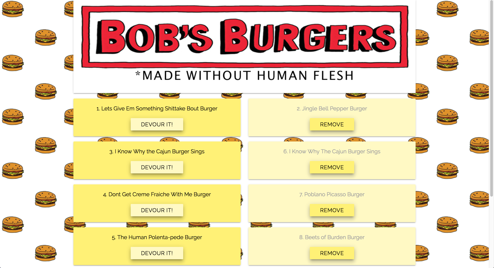
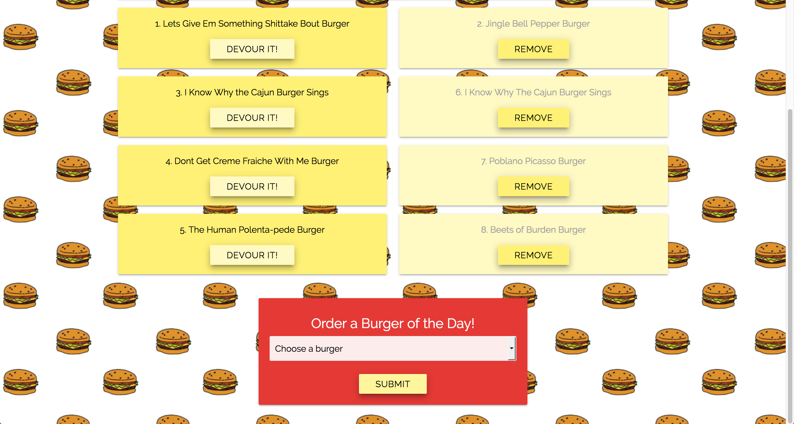

# Bob's Burgers: Burger of the Day!

## Summary
A Burger App with a Bob's Burgers Theme that allows the users to choose a burger type, then displays their choice on the left side of the screen with an option to devour it. When the Devour button is clicked, it moves the burger to the right, giving an option to 'remove'. Burgers are stored in a MySQL database. The App was created using Node Express Handlebars and a custom ORM. It uses the MVC design pattern, Node and MySQL to query and route data to the app, and Handlebars to generate the HTML.

## App Link
link here

## Example Images






## Technologies used
- Node.js
- MySQL
- Handlebars - http://handlebarsjs.com/
- body-parser NPM Package - https://www.npmjs.com/package/inquirer
- express NPM Package - https://www.npmjs.com/package/express
- mysql NPM Package - https://www.npmjs.com/package/mysql
- express-handlbars NPM Package - https://www.npmjs.com/package/express-handlebars

### Prerequisites

```
- Node.js - Download the latest version of Node https://nodejs.org/en/
```

## Built With

* Visual Studio Code
* Materialize - Wireframe
* MySql Workbench

## Authors

* **Jess Giampietro** - *JS/Node.js/Handlebars* - [Jess Giampietro]